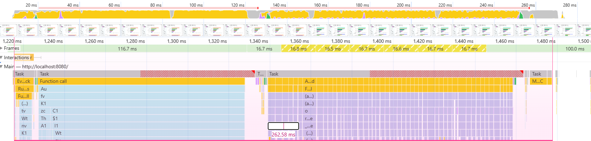
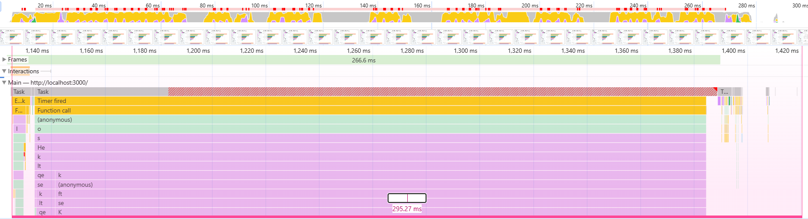

# solid-vdbb-ui

A solidjs version of [vdbb-ui](https://github.com/s-h-a-d-o-w/vdbb-ui). The styles don't quite match because this was a quick experiment regarding performance and look and feel of solid.

And at least here, solid performs a bit worse. I repeated recording the profile a few times and the difference was pretty consistent.

## Performance comparison

These profiles were recorded using production bundles, with the set of results that is committed in https://github.com/zilliztech/VectorDBBench and with the case filter disabled, so that all charts render.

### React

### Solid

What's probably noteworthy is that it looks like React schedules work in a more granular/aggressive manner, which leads to more idle time in the solid version. And for some reason, in the React version, the final paint completes right after the work is done; while with solid, it only happens after a bit of idle time. (Yes, I did not make a mistake when drawing the range in the solid performance profile. It starts at the beginning of the click, and ends when rendering is done.)

There are of course also the partial frames in the React version that actually do render preliminary charts without the final styles. If this was a commercial project, this would actually be a downside because it causes significant layout shift.